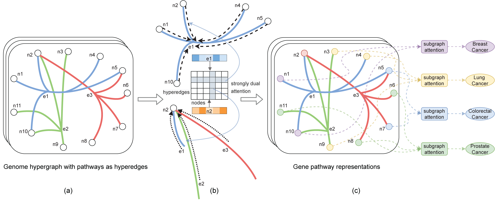

# SHINE: SubHypergraph Inductive Neural nEtwork
NeurIPS 2022 paper, SubHypergraph Inductive Neural nEtwork



**Overview of SHINE:** *SHINE jointly optimizes the objectives of end-to-end subgraph classification and hypergraph nodes' similarity regularization. SHINE simultaneously learns representations for both nodes and hyperedges using strongly dual attention message passing. The learned representations are aggregated via a subgraph attention layer and used to train a multilayer perceptron for inductive subgraph inferencing. *

### Citation
```
@inproceedings{luo2022shine,
  title={SHINE: SubHypergraph Inductive Neural nEtwork},
  author={Luo, Yuan},
  booktitle={NeurIPS},
  year={2022}
}

```
### Link to paper
[https://arxiv.org/abs/2210.07309](https://arxiv.org/abs/2210.07309)

### Downloading data
[Processed data](https://www.dropbox.com/sh/tsg57w5k97f7lbf/AACwMzddh1xbw7gsPD0FWJTRa?dl=0)

### Contact Us
Please open an issue or contact <yuan.luo@northwestern.edu> with any questions.
